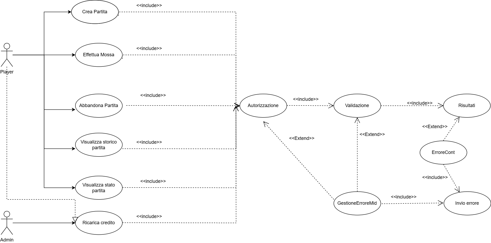
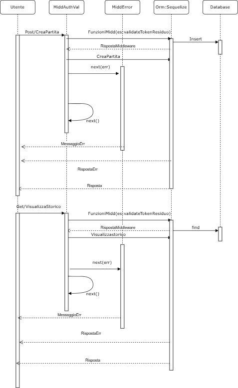

# Obiettivo del Progetto

Il progetto è stato realizzato per gestire il gioco della dama inglese tra un utente e l'intelligenza artificiale. Le mosse dell'intelligenza artificiale dipendono dal livello selezionato dall'utente (facile,medio,difficile). Gli utenti dunque sono giocatori con l'eccezione di un utente con ruolo admin.

## Specifiche richieste

*	Creare una nuova partita contro intelligenza artificiale (IA) scegliendo il livello di difficoltà.
    Un utente può partecipare al massimo ad una partita in corso.
	In particolare, è necessario validare la richiesta di creazione della partita. Per ogni partita viene addebitato un numero di token in accordo con quanto segue:
    -	0.15 all’atto della creazione
    -	0.125 per ogni mossa fatta dal giocatore
	La partita può essere creata se c’è credito sufficiente ad esaudire la richiesta. Tuttavia il costo della mossa non influisce sulla partita(La parita continua se il credito sotto forma di token risulta negativo).
*	Creare la rotta per effettuare una mossa in una data partita verificando se questa è ammissibile o meno.
*	Creare una rotta per valutare lo stato di una data partita; una partita si considera chiusa quando:
    -	Un utente / AI vince
    -	L’utente abbandona.
    -	Per ogni partita vinta al giocatore si dà 1 punto; per ogni partita interrotta -0.5 punti;
*	Creare una rotta per restituire lo storico delle mosse.
*   Creare una rotta per permettere all'utente admin di ricaricare i token per un dato giocatore(fornisce e_mail)
*   Consentire agli utenti di visualizzare le proprie partite filtrandole per data.
*   Creare una rotta che consenta di visualizzare la classifica degli utenti ordinata per numero di vittorie.

Tutte le richieste devono essere validate e autorizzate mediante tokenJwt ad esclusione della richiesta di visualizzazione della classifica.


## Librerie/Framework

* Node.Js
* Express
* Sequelize
* MySQL
* (https://github.com/loks0n/rapid-draughts)

## Rotte

| Tipo        | Rotta | Ruolo | Autentificazione JWT |
|---------|----|----|----|
| Post    | /Utenti/Partita/CreaPartita | Player| Si |
| Post    | /Utenti/Partita/:id_match/Mossa | Player| Si |
| Post    | /Utenti/Partita/:id_match/Abbandona | Player| Si |
| Post    | /Utenti/Ricarica| Admin| Si |
| Get     | /Utenti/:id_match/visualizzaStorico| Player| Si |
| Get     | /Utenti/:id_match/visualizzaStatoPartita| Player| Si |
| Get     | /Utenti/visualizzaPartiteUtente| Player| Si |
| Get     | /Utenti/visualizzaClassifica| Player| No |

I tokenJwt sono stati genererati attraverso il seguente link: https://jwt.io/. La scadenza dei TokenJwt  nel campo "exp" è stata calcolata al seguente link: https://www.unixtimestamp.com/.
Ecco un esempio di payload per l'autentificazione valido per tutte le rotte:
```json
{
  "ruolo": "player",
  "id_giocatore": 3,
  "exp": 1743321790
}
```
L'algoritmo scelto per l'header è : HS256

### • /Utenti/Partita/CreaPartita 
Dà la possibilità all'utente di creare una nuova partita. Il body della richiesta deve contenere una campo "livello" a cui dovrà essere associato un valore: facile,medio,difficile. Viene così creata una partita con il livello specificato, viene settato come valore dello stato della partita: "in corso" e viene scalata la quantità di token relativa all'uente che ha effettuato la richiesta. Inoltre, creando la partita, l'Ia effettua già la prima mossa e lo stato del gioco viene salvato.
Affinchè la richiesta sia valida:
- Il body deve contenere solo il campo livello.
- Il valore del livello può essere solo un valore tra: facile, medio, difficile.
- La quantità dei token dell'utente che effettua la richiesta deve essere maggiore della quantità richiesta per creare la partita.
- L'utente non deve avere altre partite in corso. 
Esempio body corretto:
```json
{
  "livello": "facile"
}
```

### • /Mossa
Permette di effettuare una nuova mossa relativa ad una partita in corso specificando: l'origine,la destinazione e le catture della mossa. Dove origine e destinazione indicano la casella di partenza e di arrivo della pedina; captures indica le eventuali caselle in cui la pedina ha effettuato una cattura.
Per la validazione:
- Verifica che la mossa è associata all'utente autorizzato e controlla se esiste tale partita.
- Verifica che l'origine della mossa sia valida.
- Verifica che la destinazione della mossa sia valida.
- Verifica che le catture della mossa siano valide.
- Verifica che la mossa sia ammissibile per il giocatore.
Payload token jwt identico per la rotta CreaAsta
### • /Abbandona
Permette di abbandonare una data partita specificata nel body della richiesta.

### • /Ricarica
Permetta all'utente Admin di ricaricare la una data quantità di token per un certo giocatore.
- Verifica se l'e-mail appartiene ad un giocatore registrato sul database.
- Verifica che la quantità di ricarica sia valida.

### • /visualizzaStorico
Permette di visualizzare lo storico per una data partita.

### • /visualizzaStatoPartita
Permette la visualizzazione dello stato di una partita. Esso può essere: Win,Lose,Interrotta,In corso.

Inoltre sono state create altre due ulteriori rotte:/visualizzaPartite e /visualizzaUtenti per rendere più semplice la lettura di alcune specifiche. Tali rotte hanno sempre un'autorizzazione tramite tokenJwt.

# Progettazione
## UseCaseDiagram




## SequeceDiagaram


Il diagramma delle sequenze risulta essere circa uguale per tutte le rotte. Dunque è stata riportata quella relativa alla creazione della partita e una ad una get come esempio.

## Pattern

**Middleware:** Pattern utilizzato per validare le richieste. Possono essere utilizzati più middlware per richiesta. Le funzioni di middlware sono eseguite sequanzialmente in base a come sono ordinate sullo stack. Nello specifico sono stati definiti tre strati di middlware. Uno per l'autorizzazione, uno per la convalida dei dati delle richieste e uno utile per la gestione degli errori verificatosi nei primi due strati di middleware.

**MVC:**Pattern utilizzato per dividere la logica di gestione dei dati. Si basa su tre componenti principali: Model,View,Controller. Il model si occupa di definire modelli che sono mappati con i dati del database e permette le operazioni inerenti ai dati. La view invece si occupa dalla presentazione dei dati a livello di interfaccia utente. Infine il Controller funziona come intermediario tra Model e View. Riceve le richieste dell'utente, elabora la logica necessaria e aggiorna il Model o la View di conseguenza

## L'applicazione è avviabile tramite docker-compose up --build sulla root di progetto. Inoltre è presente nella repository un file TestCollection per effettuare i test.

