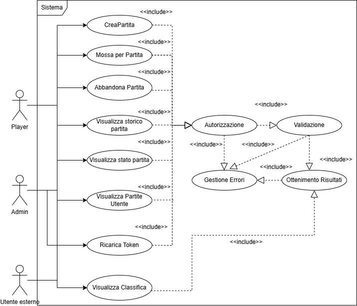
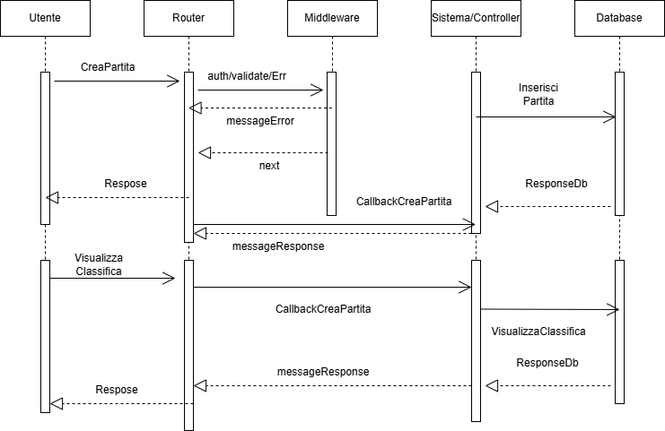

# Obiettivo del Progetto

Il progetto è stato realizzato per gestire il gioco della dama inglese tra un utente e l'intelligenza artificiale. Le mosse dell'intelligenza artificiale dipendono dal livello selezionato dall'utente (facile,medio,difficile). Gli utenti dunque sono giocatori con l'eccezione di un utente con ruolo admin.

## Specifiche richieste

*	Creare una nuova partita contro intelligenza artificiale (IA) scegliendo il livello di difficoltà.
    Un utente può partecipare al massimo ad una partita in corso.
	In particolare, è necessario validare la richiesta di creazione della partita. Per ogni partita viene addebitato un numero di token in accordo con quanto segue:
    -	0.15 all’atto della creazione
    -	0.125 per ogni mossa fatta dal giocatore
	La partita può essere creata se c’è credito sufficiente ad esaudire la richiesta. Tuttavia il costo della mossa non influisce sulla partita(La parita continua se il credito sotto forma di token risulta negativo).
*	Creare la rotta per effettuare una mossa in una data partita verificando se questa è ammissibile o meno.
*	Creare una rotta per valutare lo stato di una data partita; una partita si considera chiusa quando:
    -	Un utente / AI vince
    -	L’utente abbandona.
    -	Per ogni partita vinta al giocatore si dà 1 punto; per ogni partita interrotta -0.5 punti;
*	Creare una rotta per restituire lo storico delle mosse.
*   Creare una rotta per permettere all'utente admin di ricaricare i token per un dato giocatore(fornisce e_mail)
*   Consentire agli utenti di visualizzare le proprie partite filtrandole per data.
*   Creare una rotta che consenta di visualizzare la classifica degli utenti ordinata per numero di vittorie.

Tutte le richieste devono essere validate e autorizzate mediante tokenJwt ad esclusione della richiesta di visualizzazione della classifica.


## Librerie/Framework

* Node.Js
* Express
* Sequelize
* MySQL
* (https://github.com/loks0n/rapid-draughts)

## Rotte

| Tipo        | Rotta | Ruolo | Autentificazione JWT |
|---------|----|----|----|
| Post    | /Utenti/Partita/CreaPartita | Player| Si |
| Post    | /Utenti/Partita/:id_match/Mossa | Player| Si |
| Post    | /Utenti/Partita/:id_match/Abbandona | Player| Si |
| Post    | /Utenti/Ricarica| Admin| Si |
| Get     | /Utenti/:id_match/visualizzaStorico| Player| Si |
| Get     | /Utenti/:id_match/visualizzaStatoPartita| Player| Si |
| Get     | /Utenti/visualizzaPartiteUtente| Player| Si |
| Get     | /Utenti/visualizzaClassifica| Player| No |

I tokenJwt sono stati genererati attraverso il seguente link: https://jwt.io/. La scadenza dei TokenJwt  nel campo "exp" è stata calcolata al seguente link: https://www.unixtimestamp.com/.
Ecco un esempio di payload per l'autentificazione valido per tutte le rotte (ad esclusione della get per la classifica):
```json
{
  "ruolo": "player",
  "id_giocatore": 3,
  "exp": 1743321790
}
```
L'algoritmo scelto per l'header è : HS256

### • /Utenti/Partita/CreaPartita 
Dà la possibilità all'utente di creare una nuova partita. Il body della richiesta deve contenere una campo "livello" a cui dovrà essere associato un valore: facile,medio,difficile. Viene così creata una partita con il livello specificato; viene settato come valore dello stato della partita: "in corso" e viene scalata la quantità di token relativa all'uente che ha effettuato la richiesta. Inoltre, creando la partita, l'Ia effettua già la prima mossa e lo stato del gioco viene salvato.
Affinchè la richiesta sia valida:
- Il body deve contenere solo il campo livello.
- Il valore del livello può essere solo un valore tra: facile, medio, difficile.
- La quantità dei token dell'utente che effettua la richiesta deve essere maggiore della quantità richiesta per creare la partita.
- L'utente non deve avere altre partite in corso. 
Esempio body corretto:
```json
{
  "livello": "facile"
}
```

### • /Utenti/Partita/:id_match/Mossa
Permette di effettuare una nuova mossa relativa ad una partita in corso specificando: origine, destinazione e le catture della mossa. Dove origine e destinazione indicano la casella di partenza e di arrivo della pedina; captures indica le eventuali caselle in cui la pedina ha effettuato una cattura. Se la mossa è una mossa ammissibile per la partita, si ricostruisce il gioco riprendendolo dall'ultima mossa dell'Ia, si aggiorna la quantità di Token disponibile da parte del Player e infine si valuta se la partita è terminata o meno dopo la mossa del Player. Infine, si salva lo stato della partita e solo se la partita è terminata si cambia llo stato della partita da "In corso" a Win o Lose.
Esempio body corretto:
```json
{
    "origin":29,
    "destination":20,
    "captures":[24]
}
```
Per la validazione:
- Il body deve avere solo e soltanto i tre campi inerenti.
- Verifica che il campo origin sia un numero e che sia compreso tra 0 e 31, estremi inclusi.
- Verifica che il campo destination sia un numero compreso tra 0 e 32, estremi inclusi.
- Verifica che ohni elemento della cattura sia un numero ammissibile.
- Verifica che la mossa sia ammissibile per il giocatore e per lo stato attuale del gioco.

### • /Utenti/Partita/:id_match/Abbandona
Permette di abbandonare una data partita di un certo Player. Rwcupera lo stato della partita e esso è settato a "In corso", lo modifica in "Interrotta" e decrementa il punteggio del relativo Player.
Affinchè la richiesta sia valida, l'uente deve avere una quantità di token maggiore di 0.15.

### • /Utenti/Ricarica
Permetta all'utente Admin di ricaricare la una data quantità di token per un certo giocatore.
Esempio body corretto:
```json
{
    "e_mail":"costa@gmail.com",
    "ricaricaToken":3
}
```
- Verifica se il body della richiesta è corretto; esso deve contenere solo il campo e_mail e qToken.
- Verifica che il ruolo sia adatto; Ruolo:Admin.
- Verifica che la mail sia associata ad un utente Player e che sia una sreinga.
- Verifica che i token da ricaricare siano un numero maggiore di 0.

### • /Utenti/:id_match/visualizzaStorico
Permette di visualizzare lo storico per una data partita per un certo utente. In particolare accede alla parte dello stat Partita inerente alle mosse effettuate durante la partita. Affinchè sia valida la richiesta, la quantità di Token del Player deve essere maggiore di 0.15.

### • /Utenti/:id_match/visualizzaStatoPartita
Permette la visualizzazione dello stato di una partita. Esso può essere: Win,Lose,Interrotta,In corso. Risponde con un messaggio che descrive lo stato. Solo nel caso in cui lo stato è: "In corso", il messaggio di risposta riprende lo stato di gioco e mostra le mosse disponibili per la partita. Affinchè sia valida la quantità di token del Player deve essere maggiore di 0.15.

### • /Utenti/visualizzaPartiteUtente

Permette di visualizzare le partite di un certo utente filtrandole per data: Data inizio e data fine. 
Esempio body corretto:
```json
{
    "dataInizio":"2025-03-28",
    "dataFine":"2025-03-30"
}
```
Affinchè la richiesta si avalida:
- Il body della richiesta deve avere solo e soltanto i due campi indicati.
- Le date devono essere stringhe.
- Le date devono essere convertite correttamente nel tipo Date.
- Le date devono essere ordinate cronologicamente e coerenti.

### • /Utenti/visualizzaClassifica
Permette di visualizzare la classifica degli utenti ordinata in base al numero di vittorie. Questa rotta è l'unica che non ha bisogno di autentificazione. Se non ci sono partite con vittorie da parte degli utenti, non mostra una classifica, ma solo un messaggio che in cui si denota che non ci sono partite.


# Progettazione
## UseCaseDiagram




## SequeceDiagaram


Il diagramma delle sequenze risulta essere circa uguale per tutte le rotte. Dunque è stata riportata quella relativa alla creazione della partita come esempio e anche l'operazione di mostrare la classifica poichè è l'unica che non ha bisogno di identificazione.

## Pattern

**Middleware:** Strato software costituito da diverse funzioni tali da poter elaborare,modificare e bloccare le richieste. Ogni funzione middleware ammette tre parametri: req,res,next. Attraverso tali parametri una singola funzione è in grado di manipolare le richieste(req,res) o di passare la richiesta alla funzione di middlware successiva caricata sullo stack. Un particolare middlware è quello che si occupa di gestire gli errori. Esso, infatti, a differenza delle classiche funzioni di middlware, ammette un quarto parametro: errore. Tale variabile, viene valorizzata nel momento in cui una funzione di middlware classica manda l'eccezione al middlware degli errori. Quest'ultima provvede a gestire l'errore. L'organizzazione logica dell'uso del middlware nel progetto è stata quella di creare tre file contenenti funzioni di middlware. Il primo composto da funzioni  per l'autorizzazione, il secondo per la validazione ed infine il terzo per la gestione delle eccezioni verificatosi nelle funzioni di middlware. In sostanza, per ogni rotta è stato costruito un array contenente le funzioni di middlware ordinate per convalidare la richiesta. Se la richiesta non risulta essere ben formata allora l'eccezione viene catturata dalla funzione e viene processata dal middlware degli errori. Altrimenti la richiesta passa lo strato software ed è passata al controller.

**MVC:** Pattern utilizzato per dividere la logica di gestione dei dati. Si basa su tre componenti principali: Model,View,Controller. Il model si occupa di definire modelli che sono mappati con i dati del database e permette le operazioni inerenti ai dati. La view invece si occupa dalla presentazione dei dati a livello di interfaccia utente. Infine il Controller funziona come intermediario tra Model e View. Riceve le richieste dell'utente, elabora la logica necessaria e aggiorna il Model o la View di conseguenza. Nel progetto, trattandosi dello sviluppo backend, non sfrutta il view. Tuttavia sono stati utilizzati sia il controller che i model. In particolare sono stati definiti due modelli: Match e Users. Per ciascun modello sono stati definiti gli attributi e le relative associazioni. Riguardo il controller, invece, esso è stato diviso, a livello logico, in tre file. Ciascuno di essi è costituito da funzioni riguardo gli utenti, le partite o le mossa per la partita. Il controller manipola i dati, attraverso funzioni che sfruttano i modelli definiti ed infine si occupano di fornire una risposta. Tale risposta, avendo usato Postman per effettuare le richieste, è in formato Json. 

- L'applicazione è avviabile tramite docker-compose up --build sulla root di progetto. Inoltre è presente nella repository un file Test_collection per effettuare i test su Postman.

